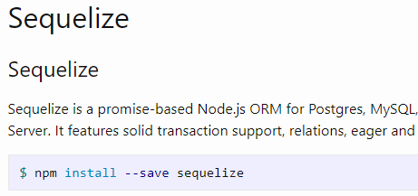

# Sequelize Walk Through

This deployed site initializes an email username and password login point but the real function of this walk through is to show the "flow of traffic" for this process utilizing Sequelize ORM.

  

## Table of Contents

* [Tech Used](#tech_used)
* [Usage](#usage)
* [Features](#features)
* [Deployed_Link](#deployed_link)
* [Author](#author)
* [Credits](#credits)
* [License](#license)

----

## Tech Used

* [HTML](https://developer.mozilla.org/en-US/docs/Web/HTML)
* [Javascript](https://developer.mozilla.org/en-US/docs/Web/JavaScript)
* [node.js](https://nodejs.org/en/)
* [npm](https://www.npmjs.com/)
* [Sequelize ORM](https://sequelize.org/)
* [MySQL](https://www.mysql.com/)

## Usage
 
 The Sequelize Walk Thtrough was created with MySQL, Node, Sequelize ORM, and NPM. To run install npm. 

## Features

The below features are a description of each file in the application.

- isAuthenticated.js is middleware that only allows registered users to continue to the member page. If the user isn't registered it redirects them to the landing page.

- config.json holds the database owners login info to authenticate access. 

- passport.js requires LocalStrategy and passport node modules to login with a password. It also requires the database to authenticate if user login input is valid.

- index.js returns stored login and password from the database, builds a model for each file and exports the db files to other files.

- user.js creates the user model, encrpys the password, and validates user from login page.

- login.js handles the user login info and the event listener on the submit button. Validates that an email and password have been entered, clears the form on valid entry, or redirects user back to the login page. 

- members.js updates the member info on the page after login.

- signup.js handles the signup user info and the event listener on the submit button. Allows new user to input new email and password login info.

- api-routes.js handles the posts for login authentication and sign up input to create a new user and the gets for retrieving user id/email.

- html-routes.js routes users with accounts to their members page and redirects nonmembers to the sign up page.

- server.js establishes the packages and ports and tracks the user login status.

## Deployed Link

* [See Live Site](https://ajhuff7.github.io/sequelize_walk_through/)

  

---

## Author

**AJ Huff** 

- [Portfolio Site](https://ajhuff7.github.io/portfolio-one/)
- [Github](https://github.com/ajhuff7)
- [LinkedIn](https://www.linkedin.com/in/aj-huff-7696b14b/)

## Credits

**The Sequelize Walk Through was designed by the staff at UC Berkeley.

## License

 